# Awesome Sales Performance Analytics 📊

## 🚀 Top Sales Performance Analytics Ecosystem & Tools

> A curated list of **commercial SaaS sales platforms** and **open-source GitHub projects** focused on pipeline intelligence, revenue forecast accuracy, deal risk detection, and self-hosted sales business intelligence (BI) analytics.

**Last updated: October 2026** 📅

---

## 💡 Overview & Key Takeaways

This repository tracks top **commercial sales performance analytics platforms** and **open-source analytics frameworks** that evaluate pipeline health, predict revenue forecasting, coach sales reps, and identify revenue risks — ranging from enterprise AI conversation intelligence to self-hosted SQL dashboards built on CRM exports.

* **Commercial Enterprise Leaders** 🏢: Salesforce Sales Analytics, Microsoft Power BI, Tableau, Gong Forecast, Clari, Looker, Aviso, Mediafly, and Atrium HQ.
* **Open-Source Sovereignty** 🔓: SQL-native dashboards (**Apache Superset**, **Metabase**, **Grafana**), code-first data apps (**Streamlit**, **Evidence.dev**), high-performance analytical databases (**ClickHouse**, **DuckDB**), and modern CRM options (**Twenty**, **SuiteCRM**, **EspoCRM**).

Contributions are warmly welcome! Please read our [How to Contribute](#-how-to-contribute) guide before opening a PR. 🤝

---

## 📑 Table of Contents

- [🏢 SaaS & Hosted Commercial Platforms](#-saas--hosted-commercial-platforms)
- [🔓 Open-Source GitHub Projects](#-open-source-github-projects)
  - [📊 Dashboard & BI Platforms](#-dashboard--bi-platforms)
  - [🚀 Modern Open-Source CRMs & Performance Systems](#-modern-open-source-crms--performance-systems)
  - [⚡ Code-First Data Apps & Semantic Layers](#-code-first-data-apps--semantic-layers)
  - [🗄️ Analytical Database Backends](#️-analytical-database-backends)
  - [🔄 Data Ingestion & Pipeline Orchestration](#-data-ingestion--pipeline-orchestration)
- [🤝 How to Contribute](#-how-to-contribute)
- [💖 Support](#-support)
- [📜 Disclaimer](#-disclaimer)
- [⭐ Star History](#-star-history)

---

## 🏢 SaaS & Hosted Commercial Platforms

> **Market Insights** 📈: The global Sales Performance Management (SPM) and Revenue Analytics market size is estimated at **$5.8 Billion (2026)** and is projected to grow to **$11.2 Billion by 2030** at a CAGR of 14.1%. The market structure is **moderately fragmented**, with enterprise suite consolidators (Salesforce, Microsoft, Google) competing against specialized revenue intelligence innovators (Gong, Clari) and high-growth AI sales automation tools.

Below is a detailed comparison of top commercial sales performance analytics products, ordered by estimated annual revenue and company market valuation (descending):

| SaaS Platform 🛠️ | Company Size (Valuation / Revenue) 💰 | Starting Tier Price 🏷️ | Free Plan / Free Trial Limit ⏳ | Key Focus & Sales Analytics Capabilities 🎯 |
| :--- | :--- | :--- | :--- | :--- |
| **[Salesforce Sales Analytics](https://www.salesforce.com/)** | **~$280B Valuation** (~$38B ARR) | $25/user/month (Starter Suite) | 30-day full feature free trial (No credit card required) | Pipeline dashboards, revenue forecasting, and Einstein AI predictive analytics native to Salesforce CRM. |
| **[Microsoft Power BI](https://powerbi.microsoft.com/)** | **~$3.1T Valuation** (Microsoft) | $14/user/month (Pro Tier) | Free local Power BI Desktop + 60-day Pro online sharing trial | Enterprise BI with Copilot AI integration, interactive sales KPI reporting, and Microsoft 365 compatibility. |
| **[Looker (Google Cloud)](https://looker.com/)** | **~$2.0T Valuation** (Alphabet / $2.6B acq.) | ~$30,000/year (Platform base + user licenses) | 30-day Google Cloud PoC / Trial instance via sales request | Governed enterprise BI powered by LookML semantic modeling for centralized sales metrics and data modeling. |
| **[Tableau (Salesforce)](https://www.tableau.com/)** | **$15.7B Valuation** (Acquisition price) | $15/user/month (Standard Tier) | 14-day full feature free trial | Visual drag-and-drop analytics, custom interactive sales dashboards, and deep CRM data integration. |
| **[Gong Forecast](https://www.gong.io/)** | **~$4.5B Valuation** (~$500M ARR) | $1,300/user/year + $5,000 platform fee base | No free tier or trial (Demo & sales-led pilot only) | AI-powered revenue intelligence, conversation analytics, pipeline inspection, and AI forecast accuracy. |
| **[Clari](https://www.clari.com/)** | **$2.6B Valuation** (~$450M ARR) | ~$1,080/user/year (Custom quote) | No free trial (Sales-led demo and enterprise pilot only) | Revenue orchestration, pipeline risk scoring, automated forecast rollups, and AI deal inspection. |
| **[Mediafly](https://www.mediafly.com/)** | **~$300M Valuation** (~$40M ARR) | Enterprise custom quote (Module based) | No free trial (Custom content assessment & demo available) | Revenue enablement, buyer engagement analytics, and Mediafly Intelligence360 pipeline reporting. |
| **[InsightSquared](https://www.insightsquared.com/)** | **Acquired by Mediafly** (~$15.3M ARR) | Custom enterprise quote (Part of Mediafly 360) | No free trial (Personalized enterprise demo required) | Pipeline velocity tracking, rep performance scorecards, and forecast accuracy (Integrated with Mediafly). |
| **[Aviso AI](https://www.aviso.com/)** | **~$250M Valuation** (~$35M ARR) | Enterprise custom quote | No permanent free tier (Time-limited evaluation trial via sales) | AI sales forecasting, deal risk prediction, deal relationship graphs, and revenue operations automation. |
| **[Atrium HQ](https://www.atriumhq.com/)** | **~$100M Valuation** (~$10.8M ARR) | Custom quote (Per rep license) | Free Account tier available (Connects to Salesforce for instant metric audits) | Data-driven sales management, rep coaching metrics, automated KPI anomaly detection, and activity tracking. |

---

## 🔓 Open-Source GitHub Projects

Below are top open-source repositories and tools for building self-hosted sales performance analytics, ordered strictly by **GitHub Stars_Count** (descending). Each Stars_Badge links directly to the repository's stargazers page! 🌟

### 📊 Dashboard & BI Platforms

- **[Grafana](https://github.com/grafana/grafana)**   
  *Operational sales dashboards & metric monitoring* — AGPL-3.0 licensed. Connects to 100+ data sources, SQL engines, and time-series databases to track real-time revenue ops metrics. 📈

- **[Apache Superset](https://github.com/apache/superset)**   
  *Enterprise open-source data exploration & sales BI platform* — Apache-2.0 licensed. Features a rich visualization library, SQL IDE, semantic layer, and Superset MCP server for LLM analytics. 🚀

- **[Metabase](https://github.com/metabase/metabase)**   
  *Self-service sales analytics & no-code question builder* — AGPL-3.0 licensed. Allows sales managers and reps to filter pipeline reports, set up alerts, and build dashboards without SQL knowledge. ❓

- **[Redash](https://github.com/getredash/redash)**   
  *SQL-driven visualization and dashboarding* — BSD-2-Clause licensed. Connect and query any data source, visualize results, and share interactive dashboards across sales operations teams. 🔍

---

### 🚀 Modern Open-Source CRMs & Performance Systems

- **[NocoDB](https://github.com/nocodb/nocodb)**   
  *Open-source Airtable alternative for sales tables* — AGPL-3.0 licensed. Turns any SQL database into a smart spreadsheet for pipeline tracking, contact enrichment, and sales KPI views. 📋

- **[Twenty](https://github.com/twentyhq/twenty)**   
  *Modern open-source CRM platform* — AGPL-3.0 licensed. Provides full control over customer data, pipeline management, activity logs, and extensible GraphQL/REST APIs for sales reporting. 💼

- **[Baserow](https://github.com/baserow/baserow)**   
  *Open-source no-code database & sales tracker* — MIT licensed. Build custom sales databases, deal trackers, and real-time collaboration dashboards on self-hosted infrastructure. 🗃️

- **[SuiteCRM](https://github.com/salesagility/SuiteCRM)**   
  *Enterprise-grade open-source CRM system* — AGPL-3.0 licensed. Comprehensive sales workflow, lead management, quotes, contracts, and built-in sales performance reporting modules. 🏢

- **[EspoCRM](https://github.com/espocrm/espocrm)**   
  *Lean open-source CRM web application* — GPL-3.0 licensed. Focuses on sales opportunity tracking, account management, call logs, and sales performance analytics. 📱

- **[SampleFlow](https://github.com/Eclipseic1848/SampleFlow)**   
  *Auditable sales target & quota management system* — Open-source. Features immutable performance event chains (append-only ledger), layered target assignment, and controlled Excel imports with rollback support. 🔐

---

### ⚡ Code-First Data Apps & Semantic Layers

- **[Streamlit](https://github.com/streamlit/streamlit)**   
  *Python framework for custom sales analytics apps* — Apache-2.0 licensed. Turn Python scripts into interactive sales dashboards and ML-powered forecasting web applications in minutes. 🐍

- **[Cube](https://github.com/cube-js/cube)**   
  *Universal semantic layer for data applications* — Apache-2.0 licensed. Define sales metrics (ARR, MRR, churn rate) once and serve them securely to any frontend or BI tool. 🧊

- **[Evidence.dev](https://github.com/evidence-dev/evidence)**   
  *Business intelligence as code* — MIT licensed. Build interactive, publication-quality sales performance reports using standard Markdown and SQL queries. 📝

- **[Lightdash](https://github.com/lightdash/lightdash)**   
  *Open-source Looker alternative for dbt users* — MIT licensed. Native semantic layer built on top of dbt models for self-service sales data exploration. 💡

---

### 🗄️ Analytical Database Backends

- **[ClickHouse](https://github.com/ClickHouse/ClickHouse)**   
  *Columnar real-time analytical database* — Apache-2.0 licensed. Powers sub-second analytical queries over hundreds of millions of CRM events and sales transaction logs. ⚡

- **[DuckDB](https://github.com/duckdb/duckdb)**   
  *In-process analytical database engine* — MIT licensed. Fast analytical querying over local CSV, Parquet, and CRM data exports right inside Python or Node.js. 🦆

- **[Apache Doris](https://github.com/apache/doris)**   
  *Real-time SQL analytical database* — Apache-2.0 licensed. High-performance sub-second analytics for pipeline aggregation and real-time sales reporting. 🏛️

- **[StarRocks](https://github.com/StarRocks/starrocks)**   
  *Next-gen real-time lakehouse analytical database* — Apache-2.0 licensed. Enables unified sub-second OLAP queries across enterprise sales data warehouses. 🌟

---

### 🔄 Data Ingestion & Pipeline Orchestration

- **[Apache Airflow](https://github.com/apache/airflow)**   
  *Workflow orchestration platform* — Apache-2.0 licensed. Programmatically author, schedule, and monitor complex CRM ELT data pipelines. 🌬️

- **[PostHog](https://github.com/PostHog/posthog)**   
  *Product & sales funnel analytics* — MIT licensed. Track product usage data, customer conversion funnels, and product-led sales (PLS) metrics. 🦔

- **[Prefect](https://github.com/prefecthq/prefect)**   
  *Pythonic workflow orchestration* — Apache-2.0 licensed. Build resilient data pipelines to sync CRM contacts, deals, and analytics backends. 🐍

- **[Airbyte](https://github.com/airbytehq/airbyte)**   
  *Open-source ELT data integration platform* — Elv2 licensed. Sync sales data from Salesforce, HubSpot, Zendesk, and Stripe into analytical warehouses. 🚚

- **[Matomo](https://github.com/matomo-org/matomo)**   
  *Web & lead attribution analytics* — GPL-3.0 licensed. Google Analytics alternative providing web lead source attribution and sales marketing tracking. 📊

- **[Dagster](https://github.com/dagster-io/dagster)**   
  *Data assets orchestrator* — Apache-2.0 licensed. Model sales data assets and data freshness for reliable sales dashboards. 🍇

- **[dbt-core](https://github.com/dbt-labs/dbt-core)**   
  *SQL transformation framework* — Apache-2.0 licensed. Transform raw CRM data into clean analytical sales tables inside data warehouses. 🛠️

- **[Great Expectations](https://github.com/great-expectations/great_expectations)**   
  *Data quality validation framework* — Apache-2.0 licensed. Validate sales data hygiene and prevent bad CRM data from breaking revenue dashboards. 🧪

- **[Jitsu](https://github.com/jitsucom/jitsu)**   
  *Open-source event ingestion stream* — MIT licensed. Segment alternative for capturing real-time sales clickstream and product activity events. ⚡

- **[Meltano](https://github.com/meltano/meltano)**   
  *CLI-first ELT data platform* — MIT licensed. Singer-based data extractor for automated sales data ingestion into analytical stores. 🦔

---

## 🤝 How to Contribute

We welcome community contributions to keep this sales analytics directory complete and up-to-date! 🌟

1. **Fork the repository** 🍴
2. **Add or edit entries** in `README.md` following the standard markdown format.
3. Ensure the project is relevant to **sales performance analytics, revenue intelligence, or CRM data visualization**.
4. Include: Name, website/repo link, Stars_Badge (for open-source), clear description, and key capabilities.
5. **Open a Pull Request** with a descriptive summary of your additions. 📬

---

## 💖 Support

Thank you for visiting and using this curated directory! If you found this list helpful, please consider **starring ⭐️**, **forking 🍴**, and **sharing 📢** this repository with your team and network. Your support helps make open-source sales analytics resources accessible to everyone!

If you'd like to support ongoing open-source work and maintenance, feel free to buy a coffee or sponsor via the [GitHub Sponsor Dashboard](https://github.com/sponsors/ishandutta2007). ☕✨

---

## 📜 Disclaimer

* This is a **community-curated overview** intended for educational and research purposes.
* **Data Privacy & Compliance**: Sales analytics platforms process sensitive customer PII and enterprise revenue data. Self-hosted deployments require strict security hardening, role-based access control (RBAC), and SOC2/GDPR compliance. 🔒
* **CRM Data Hygiene**: Analytics dashboards reflect the quality of upstream data. Ensure validation testing (e.g., Great Expectations) is applied to raw CRM exports. 🧼
* **Licensing**: Open-source projects feature varying software licenses (Apache-2.0, MIT, AGPL-3.0, GPL-3.0). Review licensing terms before incorporating into enterprise commercial products. ⚖️

---

## ⭐ Star History

---

  Made with ❤️ for <b>Sales Operations Analysts, Revenue Leaders &amp; Analytics Engineers</b>.

